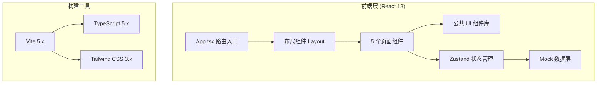
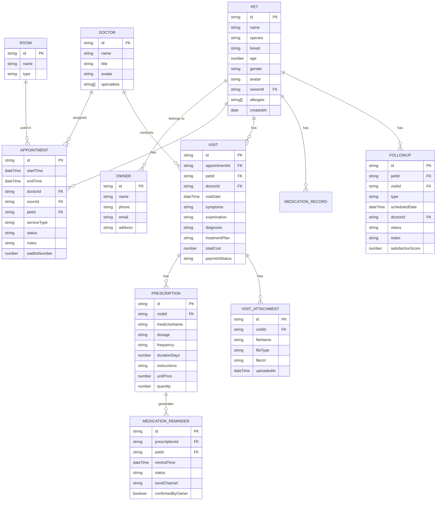

## 1. 架构设计



---

## 2. 技术选型说明

| 技术 | 版本 | 用途说明 |
|------|------|----------|
| React | 18.x | 前端核心框架，函数组件 + Hooks |
| TypeScript | 5.x | 类型安全，提升开发体验和可维护性 |
| Vite | 5.x | 构建工具，快速冷启动和热更新 |
| Tailwind CSS | 3.x | 原子化 CSS 框架，快速构建一致 UI |
| Zustand | 4.x | 轻量状态管理，替代 Redux，简化数据流 |
| React Router DOM | 6.x | 路由管理，5 个页面路由配置 |
| Lucide React | latest | 线性图标库，统一图标风格 |
| date-fns | latest | 日期时间处理，用于日历和提醒计算 |

---

## 3. 路由定义

| 路由路径 | 页面名称 | 说明 |
|----------|----------|------|
| `/` | 日历排班 | 默认首页，周视图预约排班 |
| `/calendar` | 日历排班 | 同上（别名） |
| `/pets` | 宠物档案 | 宠物及主人信息管理 |
| `/visits` | 接诊记录 | 就诊、医嘱、费用管理 |
| `/medications` | 用药提醒 | 服药计划生成与提醒发送 |
| `/followups` | 回访看板 | 术后/疫苗/复诊/满意度跟踪 |

---

## 4. 核心数据模型

### 4.1 数据模型 ER 图



### 4.2 状态管理结构（Zustand Store）

```typescript
// 主 Store 包含以下切片：
interface AppStore {
  // 宠物与主人
  pets: Pet[];
  owners: Owner[];
  addPet: (pet: Omit<Pet, 'id' | 'createdAt'>) => void;
  updatePet: (id: string, data: Partial<Pet>) => void;
  deletePet: (id: string) => void;
  
  // 医生与诊室
  doctors: Doctor[];
  rooms: Room[];
  
  // 预约
  appointments: Appointment[];
  addAppointment: (data: Omit<Appointment, 'id'>) => void;
  updateAppointment: (id: string, data: Partial<Appointment>) => void;
  cancelAppointment: (id: string) => void;
  addToWaitlist: (appointmentId: string) => void;
  
  // 接诊记录
  visits: Visit[];
  prescriptions: Prescription[];
  attachments: VisitAttachment[];
  createVisit: (data: Omit<Visit, 'id'>) => Visit;
  addPrescription: (data: Omit<Prescription, 'id'>) => void;
  
  // 用药提醒
  medicationReminders: MedicationReminder[];
  generateReminders: (prescriptionId: string) => void;
  sendReminder: (id: string, channel: 'sms' | 'wechat') => void;
  confirmReminder: (id: string) => void;
  
  // 回访
  followups: Followup[];
  createFollowup: (data: Omit<Followup, 'id'>) => void;
  completeFollowup: (id: string, data: Partial<Followup>) => void;
  
  // UI 状态
  selectedDate: Date;
  selectedDoctorId: string | null;
  selectedPetId: string | null;
  uiDispatch: (action: UIAction) => void;
}
```

---

## 5. 项目目录结构

```
src/
├── components/           # 公共组件
│   ├── layout/           # 布局相关
│   │   ├── Sidebar.tsx   # 左侧导航栏
│   │   ├── Header.tsx    # 顶部状态栏
│   │   └── Layout.tsx    # 主布局容器
│   ├── ui/               # 基础 UI 组件
│   │   ├── Button.tsx
│   │   ├── Card.tsx
│   │   ├── Badge.tsx
│   │   ├── Input.tsx
│   │   ├── Select.tsx
│   │   ├── Modal.tsx
│   │   ├── Drawer.tsx
│   │   └── Avatar.tsx
│   └── shared/           # 业务复用组件
│       ├── PetAvatar.tsx
│       ├── DoctorAvatar.tsx
│       └── StatusBadge.tsx
├── pages/                # 5 个页面
│   ├── Calendar.tsx      # 日历排班
│   ├── Pets.tsx          # 宠物档案
│   ├── Visits.tsx        # 接诊记录
│   ├── Medications.tsx   # 用药提醒
│   └── Followups.tsx     # 回访看板
├── store/                # Zustand 状态管理
│   └── useAppStore.ts
├── types/                # TypeScript 类型定义
│   └── index.ts
├── data/                 # Mock 初始数据
│   └── mockData.ts
├── utils/                # 工具函数
│   ├── date.ts           # 日期处理
│   ├── format.ts         # 格式化工具
│   └── reminders.ts      # 提醒生成器
├── App.tsx               # 路由配置
├── main.tsx              # 入口文件
└── index.css             # Tailwind 入口
```

---

## 6. 前端组件拆分策略

### 日历排班页 (`Calendar.tsx`) 拆分为：
- `Calendar/WeekView.tsx` - 7 天 × 时段网格
- `Calendar/TimeSlot.tsx` - 单个时段单元格
- `Calendar/AppointmentCard.tsx` - 预约卡片
- `Calendar/AppointmentForm.tsx` - 创建/编辑预约表单
- `Calendar/WaitlistPanel.tsx` - 候补队列面板
- `Calendar/FilterBar.tsx` - 筛选工具栏

### 宠物档案页 (`Pets.tsx`) 拆分为：
- `Pets/PetCard.tsx` - 宠物信息卡片
- `Pets/PetGrid.tsx` - 卡片网格布局
- `Pets/PetDetailDrawer.tsx` - 档案详情抽屉
- `Pets/PetForm.tsx` - 新增/编辑表单
- `Pets/VaccineTimeline.tsx` - 疫苗接种时间线
- `Pets/SearchBar.tsx` - 搜索筛选栏

### 接诊记录页 (`Visits.tsx`) 拆分为：
- `Visits/VisitList.tsx` - 就诊记录列表
- `Visits/VisitForm.tsx` - 接诊表单容器
- `Visits/SymptomsSection.tsx` - 症状检查区
- `Visits/PrescriptionEditor.tsx` - 医嘱处方编辑器
- `Visits/FeeSummary.tsx` - 费用结算
- `Visits/AttachmentUploader.tsx` - 附件上传

### 用药提醒页 (`Medications.tsx`) 拆分为：
- `Medications/Timeline.tsx` - 服药时间轴
- `Medications/TimelineItem.tsx` - 单个提醒节点
- `Medications/PlanGenerator.tsx` - 计划生成器
- `Medications/SendPanel.tsx` - 发送面板
- `Medications/StatusLegend.tsx` - 状态图例

### 回访看板页 (`Followups.tsx`) 拆分为：
- `Followups/BoardTabs.tsx` - 四大看板切换标签
- `Followups/TaskCard.tsx` - 回访任务卡片
- `Followups/TaskColumn.tsx` - 看板列
- `Followups/RecordModal.tsx` - 回访记录弹窗
- `Followups/FilterBar.tsx` - 医生/日期筛选
