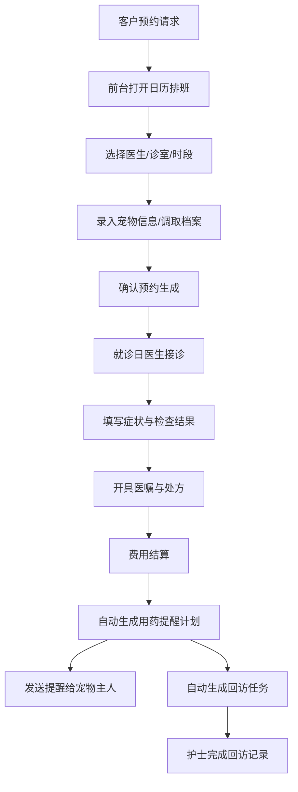
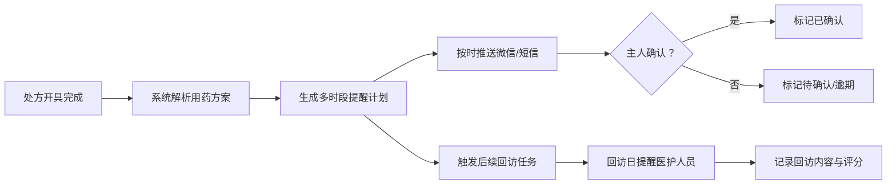

## 1. 产品概述

专为小型宠物医院设计的综合管理系统，涵盖预约排班、宠物档案、接诊记录、用药提醒和回访跟踪五大核心模块，帮助医院提高接诊效率、规范诊疗流程、提升客户满意度。

- **主要目的**：一站式管理宠物医院日常运营，从前台预约到术后回访全流程数字化
- **解决问题**：传统纸质记录易丢失、排班混乱、回访遗漏、用药提醒不及时等痛点
- **目标用户**：宠物医院前台、医生、护士及管理人员

---

## 2. 核心功能

### 2.1 用户角色

| 角色 | 权限描述 |
|------|----------|
| 前台 | 预约排班管理、改期/取消/候补操作、宠物档案录入 |
| 医生 | 接诊记录填写、医嘱开具、回访跟踪 |
| 护士 | 用药提醒管理、档案更新协助 |
| 管理员 | 全部功能权限 |

### 2.2 功能模块

1. **日历排班页**：周视图日历、预约创建、改期取消、候补队列、按医生/诊室/项目筛选
2. **宠物档案页**：宠物信息卡片、主人联系方式、疫苗记录、过敏档案、搜索筛选
3. **接诊记录页**：症状录入、检查结果、医嘱处方、费用结算、附件上传
4. **用药提醒页**：服药计划生成、时间轴展示、提醒发送、已确认/待确认状态
5. **回访看板页**：术后/疫苗/复诊/满意度四大看板、按医生/日期筛选、完成状态跟踪

### 2.3 页面详情

| 页面名称 | 模块名称 | 功能描述 |
|----------|----------|----------|
| 日历排班 | 周视图日历 | 7天×8时间段网格布局，显示各时段预约状态和颜色编码 |
| 日历排班 | 预约创建表单 | 选择医生、诊室、服务项目、时段、宠物信息，提交预约 |
| 日历排班 | 预约操作面板 | 改期、取消、候补队列管理、一键确认 |
| 日历排班 | 筛选工具栏 | 按医生、诊室、日期范围筛选预约 |
| 宠物档案 | 宠物卡片列表 | 网格布局展示宠物照片、名字、品种、年龄、主人信息 |
| 宠物档案 | 档案详情抽屉 | 展开查看完整疫苗记录、过敏史、历史就诊记录 |
| 宠物档案 | 搜索筛选栏 | 按宠物名、主人名、品种、手机号搜索 |
| 宠物档案 | 新增/编辑表单 | 录入和修改宠物及主人信息 |
| 接诊记录 | 就诊表单 | 症状描述、体格检查、辅助检查、诊断结果 |
| 接诊记录 | 医嘱处方 | 开具药品、剂量、用法、治疗项目 |
| 接诊记录 | 费用结算 | 项目明细、总费用、支付状态 |
| 接诊记录 | 附件管理 | 上传化验单、影像资料等附件 |
| 用药提醒 | 服药时间轴 | 可视化展示各时段服药计划及状态 |
| 用药提醒 | 计划生成器 | 根据处方自动生成服药提醒计划 |
| 用药提醒 | 发送面板 | 一键发送短信/微信提醒给主人 |
| 用药提醒 | 状态跟踪 | 已确认/待确认/已逾期状态标记 |
| 回访看板 | 分类看板卡片 | 术后、疫苗、复诊、满意度四大看板分区 |
| 回访看板 | 回访任务列表 | 显示待回访宠物、回访类型、建议日期、负责医生 |
| 回访看板 | 筛选控件 | 按医生、日期范围、回访类型筛选 |
| 回访看板 | 回访记录弹窗 | 记录回访内容、主人反馈、满意度评分 |

---

## 3. 核心流程

### 3.1 预约接诊主流程

客户致电/到店预约 → 前台在日历中选择空时段 → 录入宠物及服务信息 → 系统确认预约 → 就诊当日医生接诊 → 填写症状检查结果 → 开具医嘱处方 → 生成用药提醒 → 发送提醒给主人 → 自动生成回访任务 → 护士/医生完成回访记录

### 3.2 用药提醒与回访流程

接诊开具处方 → 系统解析用药频次/周期 → 生成时间轴式提醒计划 → 到点推送提醒 → 主人确认收到 → 回访日触发回访任务 → 医生/护士联系客户 → 记录反馈与满意度 → 更新任务状态

---

## 4. 用户界面设计

### 4.1 设计风格

- **主色调**：医疗风格的薄荷绿 (#10B981) 作为主色，传达健康与专业感
- **辅助色**：温暖的珊瑚橙 (#F97316) 用于强调和警示，柔蓝 (#3B82F6) 用于信息类元素
- **中性色**：暖灰白渐变背景，深灰 (#1F2937) 文字，层次分明
- **按钮风格**：圆角 12px，轻微投影，hover 时上浮 1px 并加深投影
- **字体**：正文使用现代无衬线字体，标题加粗强调，字号层次清晰
- **布局风格**：左侧固定导航栏 + 顶部状态栏 + 主内容卡片式布局
- **图标风格**：使用 Lucide 线性图标，统一 20px 尺寸，与文字基线对齐
- **整体气质**：专业洁净、温暖亲切、高效直观的医疗机构管理风格

### 4.2 页面设计概览

| 页面名称 | 模块名称 | UI 关键元素 |
|----------|----------|-------------|
| 日历排班 | 周视图网格 | 彩色时间块区分预约类型，悬停展开详情，拖拽改期 |
| 日历排班 | 预约卡片 | 宠物头像缩略 + 服务标签 + 状态徽章 + 操作按钮组 |
| 宠物档案 | 宠物卡片 | 圆角头像 + 信息网格 + 疫苗进度条 + 快速操作 |
| 宠物档案 | 详情抽屉 | 右侧滑入，分区展示基本信息/疫苗/过敏/就诊历史 |
| 接诊记录 | 表单布局 | 分区折叠面板，左侧症状/检查，右侧医嘱/费用 |
| 接诊记录 | 医嘱编辑器 | 药品选择下拉 + 剂量输入 + 频次选择 + 自动价格计算 |
| 用药提醒 | 时间轴 | 左侧竖线 + 圆形时间节点 + 状态色编码 + 渐入动画 |
| 用药提醒 | 发送确认 | 短信/微信渠道图标 + 模拟预览 + 一键发送按钮 |
| 回访看板 | 看板分区 | 顶部标签切换四类型，卡片瀑布流，状态徽章醒目 |
| 回访看板 | 任务卡片 | 宠物头像 + 回访类型标签 + 倒计时天数 + 负责人头像 |

### 4.3 响应式设计

- **设计优先级**：桌面端优先（标准使用场景为医院前台和医生工作站）
- **主要断点**：1440px（最优）、1024px（紧凑）、768px（平板横屏）
- **侧边栏**：窄屏时折叠为图标栏，宽屏展开完整菜单
- **表格/网格**：窄屏自动变为单列卡片列表
- **表单**：多列表单窄屏变为单列垂直布局
- **日历**：周视图窄屏切换为日视图
